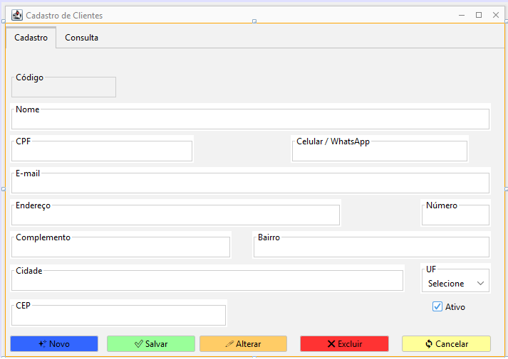
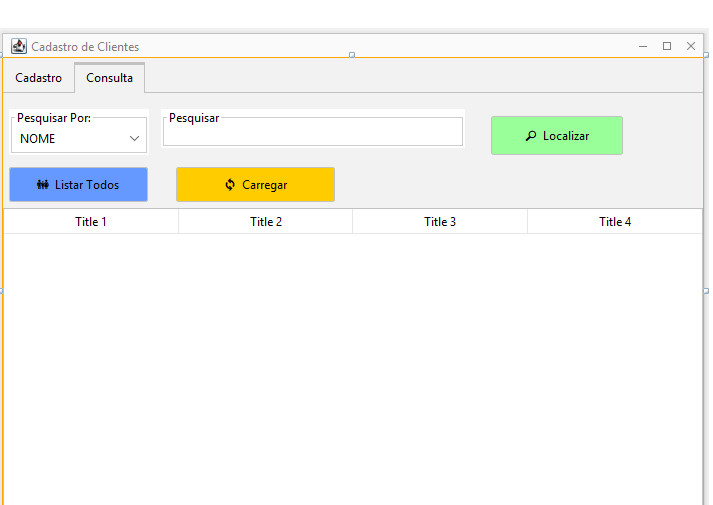

<h1 align="center">Projeto FerragemGK</h1>

<div align="center">

</div>


# Parte 4: Cadastro de Clientes com CRUD Completo

Nesta etapa, nós vamos criar juntos o nosso primeiro CRUD completo do sistema FerragemGK.

A `FrmCliente` será muito importante porque ela servirá como modelo para os próximos cadastros do projeto.

Depois que entendermos bem esta etapa, nós poderemos aplicar praticamente a mesma organização em:

* Fornecedor
* Produto
* Usuário

Nós vamos criar:

* `Cliente.java`
* `ClienteDAO.java`
* `FrmCliente.java`
* `JInternalFrame`
* `JTabbedPane`
* Aba Cadastro
* Aba Consulta
* `JTable`
* Filtros
* Localização
* Cadastro
* Alteração
* Exclusão
* Controle de permissão para MASTER e USER

Ao final desta etapa, nós teremos o primeiro cadastro totalmente integrado ao PostgreSQL.

---

# 1. Estrutura do projeto

Depois desta etapa, nossa estrutura ficará semelhante a:

```text
FerragemGK

conexao
    Conexao.java

model
    Usuario.java
    Cliente.java

dao
    UsuarioDAO.java
    ClienteDAO.java

util
    SessaoUsuario.java

view
    FrmLogin.java
    FrmPrincipal.java
    FrmCliente.java
```

Nós vamos continuar separando cada responsabilidade em seu próprio pacote.

---

# 2. Tabela cliente

No banco FerragemGK nós já criamos a tabela:

```sql
CREATE TABLE cliente (
    id_cliente BIGINT GENERATED BY DEFAULT AS IDENTITY,
    nome VARCHAR(150) NOT NULL,
    cpf VARCHAR(14),
    telefone VARCHAR(20),
    email VARCHAR(150),
    endereco VARCHAR(180),
    numero VARCHAR(20),
    complemento VARCHAR(100),
    bairro VARCHAR(100),
    cidade VARCHAR(100),
    uf CHAR(2),
    cep VARCHAR(10),
    ativo BOOLEAN NOT NULL DEFAULT TRUE,
    criado_em TIMESTAMP NOT NULL DEFAULT CURRENT_TIMESTAMP,

    CONSTRAINT pk_cliente
        PRIMARY KEY (id_cliente),

    CONSTRAINT uk_cliente_cpf
        UNIQUE (cpf),

    CONSTRAINT uk_cliente_email
        UNIQUE (email)
);
```

Agora nós vamos fazer o Java trabalhar com essa estrutura.

---

# 3. Criando a classe Cliente

Dentro do pacote:

```text
model
```

nós vamos criar:

```text
Cliente.java
```

Código completo:

```java
package model;

public class Cliente {

    private long idCliente;
    private String nome;
    private String cpf;
    private String telefone;
    private String email;
    private String endereco;
    private String numero;
    private String complemento;
    private String bairro;
    private String cidade;
    private String uf;
    private String cep;
    private boolean ativo;

    public Cliente() {
    }

    public long getIdCliente() {
        return idCliente;
    }

    public void setIdCliente(long idCliente) {
        this.idCliente = idCliente;
    }

    public String getNome() {
        return nome;
    }

    public void setNome(String nome) {
        this.nome = nome;
    }

    public String getCpf() {
        return cpf;
    }

    public void setCpf(String cpf) {
        this.cpf = cpf;
    }

    public String getTelefone() {
        return telefone;
    }

    public void setTelefone(String telefone) {
        this.telefone = telefone;
    }

    public String getEmail() {
        return email;
    }

    public void setEmail(String email) {
        this.email = email;
    }

    public String getEndereco() {
        return endereco;
    }

    public void setEndereco(String endereco) {
        this.endereco = endereco;
    }

    public String getNumero() {
        return numero;
    }

    public void setNumero(String numero) {
        this.numero = numero;
    }

    public String getComplemento() {
        return complemento;
    }

    public void setComplemento(String complemento) {
        this.complemento = complemento;
    }

    public String getBairro() {
        return bairro;
    }

    public void setBairro(String bairro) {
        this.bairro = bairro;
    }

    public String getCidade() {
        return cidade;
    }

    public void setCidade(String cidade) {
        this.cidade = cidade;
    }

    public String getUf() {
        return uf;
    }

    public void setUf(String uf) {
        this.uf = uf;
    }

    public String getCep() {
        return cep;
    }

    public void setCep(String cep) {
        this.cep = cep;
    }

    public boolean isAtivo() {
        return ativo;
    }

    public void setAtivo(boolean ativo) {
        this.ativo = ativo;
    }
}
```

---

# 4. Para que serve a classe Cliente

A classe `Cliente` representa um cliente dentro da aplicação Java.

Nós podemos criar um objeto assim:

```java
Cliente cliente = new Cliente();

cliente.setNome("Carlos da Silva");
cliente.setCpf("123.456.789/00");
cliente.setCidade("Porto Alegre");
cliente.setUf("RS");
```

Depois nós vamos enviar esse objeto para a classe:

```text
ClienteDAO
```

A DAO será responsável pela comunicação com o PostgreSQL.

---

# 5. Criando ClienteDAO

Agora nós vamos criar:

```text
dao
    ClienteDAO.java
```

No início da classe nós vamos utilizar:

```java
package dao;

import conexao.Conexao;
import model.Cliente;

import java.sql.Connection;
import java.sql.PreparedStatement;
import java.sql.ResultSet;
import java.sql.SQLException;

import java.util.ArrayList;
import java.util.List;
```

Depois:

```java
public class ClienteDAO {

}
```

Dentro dela nós vamos criar os métodos:

```text
cadastrar
alterar
excluir
buscarPorId
listarTodos
pesquisar
montarCliente
textoOuNull
```

---

# 6. Método cadastrar

Nós vamos começar pelo INSERT.

```java
public long cadastrar(
        Cliente cliente
) {

    String sql =
            "INSERT INTO cliente ("
            + "nome, "
            + "cpf, "
            + "telefone, "
            + "email, "
            + "endereco, "
            + "numero, "
            + "complemento, "
            + "bairro, "
            + "cidade, "
            + "uf, "
            + "cep, "
            + "ativo"
            + ") VALUES ("
            + "?, ?, ?, ?, ?, ?, "
            + "?, ?, ?, ?, ?, ?"
            + ") "
            + "RETURNING id_cliente";

    try (
            Connection conexao =
                    Conexao.conectar();

            PreparedStatement stmt =
                    conexao.prepareStatement(sql)
    ) {

        stmt.setString(
                1,
                cliente.getNome()
        );

        stmt.setString(
                2,
                textoOuNull(
                        cliente.getCpf()
                )
        );

        stmt.setString(
                3,
                textoOuNull(
                        cliente.getTelefone()
                )
        );

        stmt.setString(
                4,
                textoOuNull(
                        cliente.getEmail()
                )
        );

        stmt.setString(
                5,
                textoOuNull(
                        cliente.getEndereco()
                )
        );

        stmt.setString(
                6,
                textoOuNull(
                        cliente.getNumero()
                )
        );

        stmt.setString(
                7,
                textoOuNull(
                        cliente.getComplemento()
                )
        );

        stmt.setString(
                8,
                textoOuNull(
                        cliente.getBairro()
                )
        );

        stmt.setString(
                9,
                textoOuNull(
                        cliente.getCidade()
                )
        );

        stmt.setString(
                10,
                textoOuNull(
                        cliente.getUf()
                )
        );

        stmt.setString(
                11,
                textoOuNull(
                        cliente.getCep()
                )
        );

        stmt.setBoolean(
                12,
                cliente.isAtivo()
        );

        try (
                ResultSet rs =
                        stmt.executeQuery()
        ) {

            if (rs.next()) {

                return rs.getLong(
                        "id_cliente"
                );
            }
        }

    } catch (SQLException erro) {

        throw new RuntimeException(
                "Erro ao cadastrar cliente.",
                erro
        );
    }

    return 0;
}
```

---

# 7. Utilizando RETURNING

Nós utilizamos:

```sql
RETURNING id_cliente
```

O PostgreSQL cria o código automaticamente.

Com `RETURNING`, nós conseguimos receber imediatamente o código criado.

Por exemplo:

```text
Cliente cadastrado
Código gerado: 15
```

Isso será útil para confirmarmos o cadastro ao usuário.

---

# 8. Método textoOuNull

Alguns campos do cliente são opcionais.

Nós vamos criar:

```java
private String textoOuNull(
        String texto
) {

    if (
            texto == null
            || texto.trim().isEmpty()
    ) {

        return null;
    }

    return texto.trim();
}
```

Esse método transforma campos vazios em:

```text
NULL
```

Isso é especialmente importante para CPF e email, pois essas colunas possuem restrição `UNIQUE`.

---

# 9. Método alterar

Agora nós vamos criar o UPDATE.

```java
public boolean alterar(
        Cliente cliente
) {

    String sql =
            "UPDATE cliente SET "
            + "nome = ?, "
            + "cpf = ?, "
            + "telefone = ?, "
            + "email = ?, "
            + "endereco = ?, "
            + "numero = ?, "
            + "complemento = ?, "
            + "bairro = ?, "
            + "cidade = ?, "
            + "uf = ?, "
            + "cep = ?, "
            + "ativo = ? "
            + "WHERE id_cliente = ?";

    try (
            Connection conexao =
                    Conexao.conectar();

            PreparedStatement stmt =
                    conexao.prepareStatement(sql)
    ) {

        stmt.setString(1, cliente.getNome());

        stmt.setString(
                2,
                textoOuNull(cliente.getCpf())
        );

        stmt.setString(
                3,
                textoOuNull(cliente.getTelefone())
        );

        stmt.setString(
                4,
                textoOuNull(cliente.getEmail())
        );

        stmt.setString(
                5,
                textoOuNull(cliente.getEndereco())
        );

        stmt.setString(
                6,
                textoOuNull(cliente.getNumero())
        );

        stmt.setString(
                7,
                textoOuNull(cliente.getComplemento())
        );

        stmt.setString(
                8,
                textoOuNull(cliente.getBairro())
        );

        stmt.setString(
                9,
                textoOuNull(cliente.getCidade())
        );

        stmt.setString(
                10,
                textoOuNull(cliente.getUf())
        );

        stmt.setString(
                11,
                textoOuNull(cliente.getCep())
        );

        stmt.setBoolean(
                12,
                cliente.isAtivo()
        );

        stmt.setLong(
                13,
                cliente.getIdCliente()
        );

        return stmt.executeUpdate() > 0;

    } catch (SQLException erro) {

        throw new RuntimeException(
                "Erro ao alterar cliente.",
                erro
        );
    }
}
```

---

# 10. Método excluir

Agora nós vamos criar o DELETE.

```java
public boolean excluir(
        long idCliente
) {

    String sql =
            "DELETE FROM cliente "
            + "WHERE id_cliente = ?";

    try (
            Connection conexao =
                    Conexao.conectar();

            PreparedStatement stmt =
                    conexao.prepareStatement(sql)
    ) {

        stmt.setLong(
                1,
                idCliente
        );

        return stmt.executeUpdate() > 0;

    } catch (SQLException erro) {

        throw new RuntimeException(
                "Não foi possível excluir o cliente.",
                erro
        );
    }
}
```

Mais adiante, quando existirem vendas relacionadas ao cliente, o PostgreSQL poderá impedir a exclusão.

Isso será importante para preservar o histórico comercial.

---

# 11. Método buscarPorId

Nós também vamos criar:

```java
public Cliente buscarPorId(
        long idCliente
) {

    String sql =
            "SELECT * "
            + "FROM cliente "
            + "WHERE id_cliente = ?";

    try (
            Connection conexao =
                    Conexao.conectar();

            PreparedStatement stmt =
                    conexao.prepareStatement(sql)
    ) {

        stmt.setLong(
                1,
                idCliente
        );

        try (
                ResultSet rs =
                        stmt.executeQuery()
        ) {

            if (rs.next()) {

                return montarCliente(rs);
            }
        }

    } catch (SQLException erro) {

        throw new RuntimeException(
                "Erro ao localizar cliente.",
                erro
        );
    }

    return null;
}
```

Esse método será utilizado quando selecionarmos um cliente na tabela para alterar ou excluir.

---

# 12. Método montarCliente

Para evitar repetir várias vezes a leitura do `ResultSet`, nós vamos criar:

```java
private Cliente montarCliente(
        ResultSet rs
) throws SQLException {

    Cliente cliente =
            new Cliente();

    cliente.setIdCliente(
            rs.getLong("id_cliente")
    );

    cliente.setNome(
            rs.getString("nome")
    );

    cliente.setCpf(
            rs.getString("cpf")
    );

    cliente.setTelefone(
            rs.getString("telefone")
    );

    cliente.setEmail(
            rs.getString("email")
    );

    cliente.setEndereco(
            rs.getString("endereco")
    );

    cliente.setNumero(
            rs.getString("numero")
    );

    cliente.setComplemento(
            rs.getString("complemento")
    );

    cliente.setBairro(
            rs.getString("bairro")
    );

    cliente.setCidade(
            rs.getString("cidade")
    );

    cliente.setUf(
            rs.getString("uf")
    );

    cliente.setCep(
            rs.getString("cep")
    );

    cliente.setAtivo(
            rs.getBoolean("ativo")
    );

    return cliente;
}
```

---

# 13. Método listarTodos

Agora nós vamos buscar todos os clientes.

```java
public List<Cliente> listarTodos() {

    List<Cliente> clientes =
            new ArrayList<>();

    String sql =
            "SELECT * "
            + "FROM cliente "
            + "ORDER BY nome";

    try (
            Connection conexao =
                    Conexao.conectar();

            PreparedStatement stmt =
                    conexao.prepareStatement(sql);

            ResultSet rs =
                    stmt.executeQuery()
    ) {

        while (rs.next()) {

            clientes.add(
                    montarCliente(rs)
            );
        }

    } catch (SQLException erro) {

        throw new RuntimeException(
                "Erro ao listar clientes.",
                erro
        );
    }

    return clientes;
}
```

---

# 14. Método pesquisar

Nós vamos permitir pesquisa por:

```text
ID
NOME
CPF
EMAIL
```

Código:

```java
public List<Cliente> pesquisar(
        String filtro,
        String pesquisa
) {

    List<Cliente> clientes =
            new ArrayList<>();

    String sql;

    switch (filtro) {

        case "ID":

            sql =
                    "SELECT * "
                    + "FROM cliente "
                    + "WHERE id_cliente = ? "
                    + "ORDER BY nome";

            break;

        case "CPF":

            sql =
                    "SELECT * "
                    + "FROM cliente "
                    + "WHERE cpf ILIKE ? "
                    + "ORDER BY nome";

            break;

        case "EMAIL":

            sql =
                    "SELECT * "
                    + "FROM cliente "
                    + "WHERE email ILIKE ? "
                    + "ORDER BY nome";

            break;

        default:

            sql =
                    "SELECT * "
                    + "FROM cliente "
                    + "WHERE nome ILIKE ? "
                    + "ORDER BY nome";

            break;
    }

    try (
            Connection conexao =
                    Conexao.conectar();

            PreparedStatement stmt =
                    conexao.prepareStatement(sql)
    ) {

        if (filtro.equals("ID")) {

            stmt.setLong(
                    1,
                    Long.parseLong(pesquisa)
            );

        } else {

            stmt.setString(
                    1,
                    "%"
                    + pesquisa
                    + "%"
            );
        }

        try (
                ResultSet rs =
                        stmt.executeQuery()
        ) {

            while (rs.next()) {

                clientes.add(
                        montarCliente(rs)
                );
            }
        }

    } catch (SQLException erro) {

        throw new RuntimeException(
                "Erro ao pesquisar clientes.",
                erro
        );
    }

    return clientes;
}
```

---

# 15. Entendendo ILIKE

No PostgreSQL, nós vamos utilizar:

```sql
ILIKE
```

Ele permite pesquisar ignorando diferenças entre letras maiúsculas e minúsculas.

Por exemplo:

```text
Maria
MARIA
maria
MaRiA
```

podem localizar o mesmo cliente.

Também utilizamos:

```java
"%" + pesquisa + "%"
```

Isso permite uma pesquisa parcial.

Se digitarmos:

```text
Silva
```

poderemos encontrar:

```text
Carlos Silva
Maria da Silva
João Silva Santos
```

---

# 16. Criando a FrmCliente

Agora nós vamos criar a interface.

Dentro do pacote:

```text
view
```

vamos escolher:

```text
New
```

Depois:

```text
JInternalFrame Form
```

Nome:

```text
FrmCliente
```

---

# 17. Construtor da FrmCliente

No construtor nós vamos utilizar:

```java
public FrmCliente() {

    initComponents();

    configurarTela();

    listarClientes();

    limparCampos();
}
```

---

# 18. Propriedades do JInternalFrame

No NetBeans nós vamos configurar:

```text
Title
Cadastro de Clientes

Closable
true

Iconifiable
true

Maximizable
true

Resizable
true
```

Assim, nossa tela poderá ser fechada, minimizada, maximizada e redimensionada dentro do `JDesktopPane`.

---

<h1 align="center">Telas</h1>

<div align="center">

</div>

<div align="center">

</div>


# 19. Criando o JTabbedPane

Dentro da `FrmCliente`, nós vamos adicionar:

```text
JTabbedPane
```

Nome da variável:

```text
tabCliente
```

Ele terá duas abas:

```text
Cadastro
Consulta
```

Visualmente:

```text
===============================================

Cadastro | Consulta

===============================================
```

---

# 20. Aba Cadastro

Na aba Cadastro nós vamos criar os seguintes campos:

```text
Código
Nome
CPF
Telefone
Email
Endereço
Número
Complemento
Bairro
Cidade
UF
CEP
Ativo
```

Nomes das variáveis:

```text
txtCodigo
txtNome
txtCpf
txtTelefone
txtEmail
txtEndereco
txtNumero
txtComplemento
txtBairro
txtCidade
cmbUf
txtCep
chkAtivo
```

---

# 21. Campo Código

O campo:

```text
txtCodigo
```

não deverá ser digitado manualmente.

Nós vamos utilizar:

```java
txtCodigo.setEditable(false);
```

O código será criado automaticamente pelo PostgreSQL.

---

# 22. Criando o JComboBox de UF

No componente:

```text
cmbUf
```

nós podemos inserir:

```text
Selecione
AC
AL
AP
AM
BA
CE
DF
ES
GO
MA
MT
MS
MG
PA
PB
PR
PE
PI
RJ
RN
RS
RO
RR
SC
SP
SE
TO
```

---

# 23. Botões da aba Cadastro

Nós vamos criar:

```text
Novo
Salvar
Alterar
Excluir
Cancelar
```

Nomes:

```text
btnNovo
btnSalvar
btnAlterar
btnExcluir
btnCancelar
```

---

# 24. Aba Consulta

Na aba Consulta nós vamos criar:

```text
Filtro
Pesquisa
Localizar
Listar Todos
Carregar Selecionado
JTable
```

Nomes:

```text
cmbFiltro
txtPesquisa
btnLocalizar
btnListarTodos
btnCarregar
tblClientes
```

---

# 25. Filtros

O `cmbFiltro` terá:

```text
NOME
ID
CPF
EMAIL
```

Nós vamos deixar `NOME` como primeira opção.

---

# 26. Colunas da JTable

A `tblClientes` poderá apresentar:

```text
Código
Nome
CPF
Telefone
Email
Cidade
UF
Ativo
```

Nós não precisamos mostrar todos os campos na tabela.

Quando o usuário selecionar um registro, nós vamos buscar os dados completos pelo ID.

---

# 27. Imports da FrmCliente

No início da classe nós vamos adicionar:

```java
import dao.ClienteDAO;

import java.util.List;

import javax.swing.JOptionPane;

import javax.swing.table.DefaultTableModel;

import model.Cliente;

import util.SessaoUsuario;
```

---

# 28. Criando ClienteDAO dentro da tela

Dentro da classe nós vamos criar:

```java
private final ClienteDAO clienteDAO =
        new ClienteDAO();
```

Também criaremos:

```java
private long idClienteSelecionado = 0;
```

Quando esse valor estiver em:

```text
0
```

significa que nenhum cliente está carregado para edição.

---

# 29. Método configurarTela

Nós vamos criar:

```java
private void configurarTela() {

    txtCodigo.setEditable(false);

    btnExcluir.setEnabled(
            SessaoUsuario.isMaster()
    );

    tblClientes.setSelectionMode(
            javax.swing.ListSelectionModel
                    .SINGLE_SELECTION
    );

    tblClientes.setAutoCreateRowSorter(
            true
    );

    tblClientes.setModel(
            criarModeloTabela()
    );
}
```

---

# 30. Controle de permissão

Nós utilizamos:

```java
btnExcluir.setEnabled(
        SessaoUsuario.isMaster()
);
```

Se o usuário for MASTER:

```text
Excluir habilitado
```

Se for USER:

```text
Excluir desabilitado
```

Mais adiante nós também vamos validar a permissão dentro do próprio evento de exclusão.

---

# 31. Criando o modelo da JTable

Nós vamos criar:

```java
private DefaultTableModel criarModeloTabela() {

    return new DefaultTableModel(
            new Object[]{
                "Código",
                "Nome",
                "CPF",
                "Telefone",
                "Email",
                "Cidade",
                "UF",
                "Ativo"
            },
            0
    ) {

        @Override
        public boolean isCellEditable(
                int row,
                int column
        ) {

            return false;
        }
    };
}
```

Nós estamos impedindo a edição direta na tabela.

As alterações serão realizadas na aba Cadastro.

---

# 32. Método preencherTabela

Agora nós vamos criar:

```java
private void preencherTabela(
        List<Cliente> clientes
) {

    DefaultTableModel modelo =
            (DefaultTableModel)
            tblClientes.getModel();

    modelo.setRowCount(0);

    for (
            Cliente cliente :
            clientes
    ) {

        modelo.addRow(
                new Object[]{
                    cliente.getIdCliente(),
                    cliente.getNome(),
                    cliente.getCpf(),
                    cliente.getTelefone(),
                    cliente.getEmail(),
                    cliente.getCidade(),
                    cliente.getUf(),
                    cliente.isAtivo()
                            ? "Sim"
                            : "Não"
                }
        );
    }
}
```

---

# 33. Método listarClientes

Nós vamos criar:

```java
private void listarClientes() {

    try {

        preencherTabela(
                clienteDAO.listarTodos()
        );

    } catch (Exception erro) {

        JOptionPane.showMessageDialog(
                this,
                "Erro ao carregar clientes.\n"
                + erro.getMessage()
        );
    }
}
```

Esse método buscará todos os clientes no PostgreSQL e preencherá a `JTable`.

---

# 34. Método limparCampos

Agora vamos criar:

```java
private void limparCampos() {

    idClienteSelecionado = 0;

    txtCodigo.setText("");
    txtNome.setText("");
    txtCpf.setText("");
    txtTelefone.setText("");
    txtEmail.setText("");
    txtEndereco.setText("");
    txtNumero.setText("");
    txtComplemento.setText("");
    txtBairro.setText("");
    txtCidade.setText("");
    txtCep.setText("");

    cmbUf.setSelectedIndex(0);

    chkAtivo.setSelected(true);

    txtNome.requestFocus();
}
```

---

# 35. Método validarCampos

Nesta primeira versão, o nome será obrigatório.

Também vamos verificar a UF quando uma cidade tiver sido informada.

```java
private boolean validarCampos() {

    if (
            txtNome
            .getText()
            .trim()
            .isEmpty()
    ) {

        JOptionPane.showMessageDialog(
                this,
                "Informe o nome do cliente."
        );

        txtNome.requestFocus();

        return false;
    }

    if (
            cmbUf.getSelectedIndex() == 0
            && !txtCidade
                    .getText()
                    .trim()
                    .isEmpty()
    ) {

        JOptionPane.showMessageDialog(
                this,
                "Selecione a UF."
        );

        cmbUf.requestFocus();

        return false;
    }

    return true;
}
```

---

# 36. Método criarClienteComCampos

Nós não queremos repetir a leitura dos componentes no Salvar e no Alterar.

Por isso vamos criar:

```java
private Cliente criarClienteComCampos() {

    Cliente cliente =
            new Cliente();

    cliente.setIdCliente(
            idClienteSelecionado
    );

    cliente.setNome(
            txtNome
            .getText()
            .trim()
    );

    cliente.setCpf(
            txtCpf
            .getText()
            .trim()
    );

    cliente.setTelefone(
            txtTelefone
            .getText()
            .trim()
    );

    cliente.setEmail(
            txtEmail
            .getText()
            .trim()
    );

    cliente.setEndereco(
            txtEndereco
            .getText()
            .trim()
    );

    cliente.setNumero(
            txtNumero
            .getText()
            .trim()
    );

    cliente.setComplemento(
            txtComplemento
            .getText()
            .trim()
    );

    cliente.setBairro(
            txtBairro
            .getText()
            .trim()
    );

    cliente.setCidade(
            txtCidade
            .getText()
            .trim()
    );

    if (
            cmbUf.getSelectedIndex() > 0
    ) {

        cliente.setUf(
                cmbUf
                .getSelectedItem()
                .toString()
        );

    } else {

        cliente.setUf("");
    }

    cliente.setCep(
            txtCep
            .getText()
            .trim()
    );

    cliente.setAtivo(
            chkAtivo.isSelected()
    );

    return cliente;
}
```

---

# 37. Botão Novo

No evento do botão Novo:

```java
private void btnNovoActionPerformed(
        java.awt.event.ActionEvent evt
) {

    limparCampos();

    tabCliente.setSelectedIndex(0);
}
```

Esse botão prepara a tela para um novo cadastro.

---

# 38. Botão Salvar

Nós vamos criar:

```java
private void btnSalvarActionPerformed(
        java.awt.event.ActionEvent evt
) {

    if (
            idClienteSelecionado != 0
    ) {

        JOptionPane.showMessageDialog(
                this,
                "Existe um cliente carregado para edição.\n"
                + "Utilize Alterar ou clique em Novo."
        );

        return;
    }

    if (!validarCampos()) {

        return;
    }

    try {

        Cliente cliente =
                criarClienteComCampos();

        long codigo =
                clienteDAO.cadastrar(
                        cliente
                );

        JOptionPane.showMessageDialog(
                this,
                "Cliente cadastrado com sucesso.\n"
                + "Código: "
                + codigo
        );

        limparCampos();

        listarClientes();

    } catch (Exception erro) {

        JOptionPane.showMessageDialog(
                this,
                "Não foi possível cadastrar o cliente.\n"
                + erro.getMessage()
        );
    }
}
```

---

# 39. Fluxo do botão Salvar

Quando o usuário clicar em Salvar:

```text
FrmCliente
    ↓
validarCampos
    ↓
criarClienteComCampos
    ↓
Cliente
    ↓
ClienteDAO
    ↓
INSERT
    ↓
PostgreSQL
    ↓
Código gerado
```

---

# 40. Botão Localizar

Na aba Consulta, nós vamos criar:

```java
private void btnLocalizarActionPerformed(
        java.awt.event.ActionEvent evt
) {

    String pesquisa =
            txtPesquisa
            .getText()
            .trim();

    String filtro =
            cmbFiltro
            .getSelectedItem()
            .toString();

    if (pesquisa.isEmpty()) {

        listarClientes();

        return;
    }

    if (filtro.equals("ID")) {

        try {

            Long.parseLong(
                    pesquisa
            );

        } catch (
                NumberFormatException erro
        ) {

            JOptionPane.showMessageDialog(
                    this,
                    "Para pesquisar por ID informe apenas números."
            );

            txtPesquisa.requestFocus();

            return;
        }
    }

    try {

        List<Cliente> clientes =
                clienteDAO.pesquisar(
                        filtro,
                        pesquisa
                );

        preencherTabela(
                clientes
        );

        if (clientes.isEmpty()) {

            JOptionPane.showMessageDialog(
                    this,
                    "Nenhum cliente encontrado."
            );
        }

    } catch (Exception erro) {

        JOptionPane.showMessageDialog(
                this,
                "Erro na pesquisa.\n"
                + erro.getMessage()
        );
    }
}
```

---

# 41. Botão Listar Todos

Código:

```java
private void btnListarTodosActionPerformed(
        java.awt.event.ActionEvent evt
) {

    txtPesquisa.setText("");

    listarClientes();
}
```

---

# 42. Carregando o cliente selecionado

Agora vamos criar:

```java
private void carregarClienteSelecionado() {

    int linha =
            tblClientes.getSelectedRow();

    if (linha == -1) {

        JOptionPane.showMessageDialog(
                this,
                "Selecione um cliente na tabela."
        );

        return;
    }

    int linhaModelo =
            tblClientes.convertRowIndexToModel(
                    linha
            );

    long idCliente =
            Long.parseLong(
                    tblClientes
                    .getModel()
                    .getValueAt(
                            linhaModelo,
                            0
                    )
                    .toString()
            );

    try {

        Cliente cliente =
                clienteDAO.buscarPorId(
                        idCliente
                );

        if (cliente == null) {

            JOptionPane.showMessageDialog(
                    this,
                    "Cliente não encontrado."
            );

            return;
        }

        preencherCampos(
                cliente
        );

        tabCliente.setSelectedIndex(
                0
        );

    } catch (Exception erro) {

        JOptionPane.showMessageDialog(
                this,
                "Erro ao carregar cliente.\n"
                + erro.getMessage()
        );
    }
}
```

---

# 43. Entendendo convertRowIndexToModel

Nós habilitamos:

```java
tblClientes.setAutoCreateRowSorter(true);
```

Isso permite ordenar a tabela clicando nos títulos das colunas.

Depois da ordenação, a linha exibida visualmente pode não ser a mesma posição interna do modelo.

Por isso nós utilizamos:

```java
convertRowIndexToModel
```

Assim nós sempre pegamos o registro correto.

---

# 44. Método preencherCampos

Agora criaremos:

```java
private void preencherCampos(
        Cliente cliente
) {

    idClienteSelecionado =
            cliente.getIdCliente();

    txtCodigo.setText(
            String.valueOf(
                    cliente.getIdCliente()
            )
    );

    txtNome.setText(
            valorTexto(
                    cliente.getNome()
            )
    );

    txtCpf.setText(
            valorTexto(
                    cliente.getCpf()
            )
    );

    txtTelefone.setText(
            valorTexto(
                    cliente.getTelefone()
            )
    );

    txtEmail.setText(
            valorTexto(
                    cliente.getEmail()
            )
    );

    txtEndereco.setText(
            valorTexto(
                    cliente.getEndereco()
            )
    );

    txtNumero.setText(
            valorTexto(
                    cliente.getNumero()
            )
    );

    txtComplemento.setText(
            valorTexto(
                    cliente.getComplemento()
            )
    );

    txtBairro.setText(
            valorTexto(
                    cliente.getBairro()
            )
    );

    txtCidade.setText(
            valorTexto(
                    cliente.getCidade()
            )
    );

    txtCep.setText(
            valorTexto(
                    cliente.getCep()
            )
    );

    if (
            cliente.getUf() != null
            && !cliente
                    .getUf()
                    .isBlank()
    ) {

        cmbUf.setSelectedItem(
                cliente.getUf()
        );

    } else {

        cmbUf.setSelectedIndex(0);
    }

    chkAtivo.setSelected(
            cliente.isAtivo()
    );
}
```

---

# 45. Método valorTexto

Campos opcionais podem voltar como `null`.

Para evitar que a palavra:

```text
null
```

apareça nos componentes, nós vamos criar:

```java
private String valorTexto(
        String valor
) {

    if (valor == null) {

        return "";
    }

    return valor;
}
```

---

# 46. Botão Carregar Selecionado

O evento será:

```java
private void btnCarregarActionPerformed(
        java.awt.event.ActionEvent evt
) {

    carregarClienteSelecionado();
}
```

---

# 47. Abrindo com duplo clique

Nós também podemos permitir que o usuário dê dois cliques em uma linha da `JTable`.

No evento:

```text
mouseClicked
```

da `tblClientes`:

```java
private void tblClientesMouseClicked(
        java.awt.event.MouseEvent evt
) {

    if (
            evt.getClickCount() == 2
    ) {

        carregarClienteSelecionado();
    }
}
```

---

# 48. Botão Alterar

Agora nós vamos criar o UPDATE pela interface.

```java
private void btnAlterarActionPerformed(
        java.awt.event.ActionEvent evt
) {

    if (
            idClienteSelecionado == 0
    ) {

        JOptionPane.showMessageDialog(
                this,
                "Localize e carregue um cliente antes de alterar."
        );

        return;
    }

    if (!validarCampos()) {

        return;
    }

    int resposta =
            JOptionPane.showConfirmDialog(
                    this,
                    "Deseja salvar as alterações deste cliente?",
                    "Alterar Cliente",
                    JOptionPane.YES_NO_OPTION
            );

    if (
            resposta
            != JOptionPane.YES_OPTION
    ) {

        return;
    }

    try {

        Cliente cliente =
                criarClienteComCampos();

        boolean alterado =
                clienteDAO.alterar(
                        cliente
                );

        if (alterado) {

            JOptionPane.showMessageDialog(
                    this,
                    "Cliente alterado com sucesso."
            );

            limparCampos();

            listarClientes();

        } else {

            JOptionPane.showMessageDialog(
                    this,
                    "Nenhum registro foi alterado."
            );
        }

    } catch (Exception erro) {

        JOptionPane.showMessageDialog(
                this,
                "Não foi possível alterar o cliente.\n"
                + erro.getMessage()
        );
    }
}
```

---

# 49. Botão Excluir

Agora nós vamos aplicar o controle de permissão.

```java
private void btnExcluirActionPerformed(
        java.awt.event.ActionEvent evt
) {

    if (
            !SessaoUsuario.isMaster()
    ) {

        JOptionPane.showMessageDialog(
                this,
                "Você não possui permissão para excluir clientes."
        );

        return;
    }

    if (
            idClienteSelecionado == 0
    ) {

        JOptionPane.showMessageDialog(
                this,
                "Localize e carregue um cliente antes de excluir."
        );

        return;
    }

    int resposta =
            JOptionPane.showConfirmDialog(
                    this,
                    "Deseja realmente excluir este cliente?",
                    "Excluir Cliente",
                    JOptionPane.YES_NO_OPTION
            );

    if (
            resposta
            != JOptionPane.YES_OPTION
    ) {

        return;
    }

    try {

        boolean excluido =
                clienteDAO.excluir(
                        idClienteSelecionado
                );

        if (excluido) {

            JOptionPane.showMessageDialog(
                    this,
                    "Cliente excluído com sucesso."
            );

            limparCampos();

            listarClientes();

        } else {

            JOptionPane.showMessageDialog(
                    this,
                    "Cliente não encontrado."
            );
        }

    } catch (Exception erro) {

        JOptionPane.showMessageDialog(
                this,
                "Não foi possível excluir o cliente.\n"
                + "O cliente pode possuir registros vinculados.\n"
                + erro.getMessage()
        );
    }
}
```

---

# 50. Dupla proteção para exclusão

Nós temos duas proteções.

Na configuração da tela:

```java
btnExcluir.setEnabled(
        SessaoUsuario.isMaster()
);
```

E dentro do evento:

```java
if (
        !SessaoUsuario.isMaster()
)
```

Assim temos:

```text
Interface
    ↓
Botão bloqueado
```

e:

```text
Regra
    ↓
Operação bloqueada
```

---

# 51. Botão Cancelar

O botão Cancelar será simples:

```java
private void btnCancelarActionPerformed(
        java.awt.event.ActionEvent evt
) {

    limparCampos();
}
```

---

# 52. Ligando FrmCliente à FrmPrincipal

Agora nossa opção:

```text
Cadastros
    Clientes
```

já poderá abrir uma tela real.

Na `FrmPrincipal`:

```java
private void mnuClientesActionPerformed(
        java.awt.event.ActionEvent evt
) {

    abrirTela(
            new FrmCliente()
    );
}
```

---

# 53. Fluxo completo do cadastro

```text
FrmPrincipal
    ↓
Cadastros
    ↓
Clientes
    ↓
FrmCliente
    ↓
Aba Cadastro
    ↓
Novo
    ↓
Digitar dados
    ↓
Salvar
    ↓
Cliente
    ↓
ClienteDAO
    ↓
INSERT
    ↓
PostgreSQL
```

---

# 54. Fluxo completo da consulta

```text
Aba Consulta
    ↓
Escolher filtro
    ↓
Digitar pesquisa
    ↓
Localizar
    ↓
ClienteDAO
    ↓
SELECT
    ↓
JTable
```

---

# 55. Fluxo da alteração

```text
Consulta
    ↓
Selecionar cliente
    ↓
Carregar Selecionado
    ↓
buscarPorId
    ↓
Aba Cadastro
    ↓
Modificar dados
    ↓
Alterar
    ↓
UPDATE
```

---

# 56. Fluxo da exclusão

```text
Cliente carregado
    ↓
Excluir
    ↓
SessaoUsuario.isMaster
    ↓
MASTER
    ↓
Confirmação
    ↓
DELETE
```

Para USER:

```text
Excluir
    ↓
Permissão negada
```

---

# 57. Testando o cadastro

Nós vamos cadastrar um cliente de teste.

```text
Nome:
João da Silva

CPF:
123.456.789/00

Telefone:
51 99999 9999

Email:
joao@email.com

Cidade:
Porto Alegre

UF:
RS

Ativo:
Sim
```

Depois clicamos em:

```text
Salvar
```

O registro deverá aparecer na aba Consulta.

---

# 58. Testando filtro por nome

Na aba Consulta:

```text
Filtro:
NOME
```

Pesquisa:

```text
João
```

Depois:

```text
Localizar
```

A tabela deverá mostrar os clientes encontrados.

---

# 59. Testando pesquisa parcial

Digite:

```text
Silva
```

Nós também poderemos encontrar:

```text
João da Silva
```

Isso acontece porque estamos utilizando:

```sql
ILIKE '%Silva%'
```

---

# 60. Testando alteração

Selecione:

```text
João da Silva
```

Clique:

```text
Carregar Selecionado
```

Altere algum dado.

Por exemplo:

```text
Telefone
```

Depois clique:

```text
Alterar
```

A consulta deverá mostrar o novo valor.

---

# 61. Testando exclusão com MASTER

Entre no sistema como:

```text
Login:
master

Senha:
1234
```

Abra o cadastro de clientes.

Carregue um cliente.

O botão:

```text
Excluir
```

deverá estar habilitado.

Depois de clicar, o sistema deverá pedir confirmação.

---

# 62. Testando exclusão com USER

Faça logout.

Entre como:

```text
Login:
user

Senha:
1234
```

Abra Clientes.

O botão:

```text
Excluir
```

deverá estar desabilitado.

Assim nós já conseguimos visualizar a diferença entre os níveis de acesso.

---

# 63. Clientes relacionados a vendas

Quando criarmos o módulo de vendas, um cliente poderá possuir registros relacionados na tabela:

```text
venda
```

Como a chave estrangeira foi criada utilizando:

```sql
ON DELETE RESTRICT
```

o PostgreSQL poderá impedir que esse cliente seja excluído.

Isso é importante para preservar o histórico das vendas.

Nesses casos, nós poderemos utilizar:

```text
ativo = false
```

em vez de excluir fisicamente o cadastro.

---

# 64. Padrão arquitetural criado

Agora nós temos:

```text
MODEL
    ↓
Cliente

DAO
    ↓
ClienteDAO

VIEW
    ↓
FrmCliente

BANCO
    ↓
cliente
```

Esse padrão será reaproveitado em vários outros módulos.

---

# 65. Métodos principais da FrmCliente

Nossa tela terá:

```text
configurarTela
criarModeloTabela
preencherTabela
listarClientes
limparCampos
validarCampos
criarClienteComCampos
carregarClienteSelecionado
preencherCampos
valorTexto
```

Isso evita colocar toda a lógica diretamente dentro dos botões.

---

# 66. Métodos principais da ClienteDAO

Nossa DAO terá:

```text
cadastrar
alterar
excluir
buscarPorId
listarTodos
pesquisar
montarCliente
textoOuNull
```

---

# 67. Divisão das responsabilidades

Nós estamos criando a seguinte organização:

```text
FrmCliente
    ↓
Interface e interação

Cliente
    ↓
Dados

ClienteDAO
    ↓
SQL e banco

Conexao
    ↓
JDBC

PostgreSQL
    ↓
Armazenamento
```

Essa divisão será mantida durante todo o projeto.

---

# 68. Resultado desta etapa

Ao concluir esta parte, nosso sistema terá:

```text
Login
    ↓
FrmPrincipal
    ↓
Cadastros
    ↓
Clientes
    ↓
JTabbedPane
    ↓
Cadastro e Consulta
```

Nós já teremos trabalhado com:

```text
INSERT
SELECT
UPDATE
DELETE
PreparedStatement
ResultSet
JInternalFrame
JTabbedPane
JTable
DefaultTableModel
Filtros
Pesquisa parcial
Localização
Alteração
Exclusão
Permissões
MASTER
USER
```

---

# 69. Próxima etapa

Na próxima etapa nós vamos criar:

```text
FrmFornecedor
```

Nós vamos reutilizar o mesmo padrão criado em Clientes.

O novo módulo terá:

```text
Fornecedor.java
FornecedorDAO.java
FrmFornecedor.java
JTabbedPane
Cadastro
Consulta
JTable
Filtros
Localizar
Alterar
Excluir
Controle de permissão
```

Os principais campos serão:

```text
Razão Social
Nome Fantasia
CNPJ
Telefone
Email
Endereço
Número
Complemento
Bairro
Cidade
UF
CEP
Ativo
```

Nós vamos fazer essa evolução juntos, reaproveitando o que já aprendemos no cadastro de clientes.
